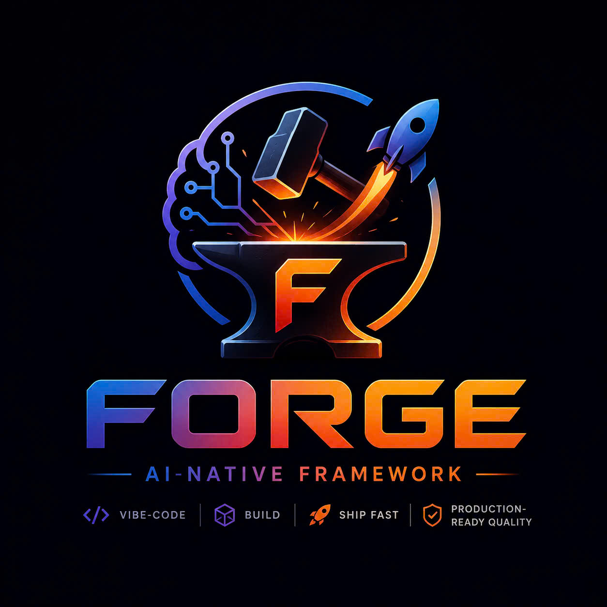

# forge

<p align="center">
  
</p>

> The LLM-native framework that makes AI-generated code survive contact with real users — security, multi-tenancy, audit, and observability built in, not bolted on.

**Status:** M3 Preview — **18 verbs available** (`version`, `doctor`, `new`, `init`, `clean`, `explain`, `scan`, `lint`, `ship`, `upgrade`, `audit`, `plugin`, `eval`, `postmortem`, `insights`, `spend`, `incident`, `telemetry`). See [docs/DEVELOPMENT_PLAN.md](docs/DEVELOPMENT_PLAN.md) for the milestone roadmap and [docs/ERROR_CODES.md](docs/ERROR_CODES.md) for the full `FORGE-XXXX` catalogue.

**Install (no Go required):**
```sh
npm install -g @forge/cli
```

## Spec-driven repo

This repo is **spec-first**. Every feature lands as: `spec` → ADR → red test → green code → docs.

| Doc | Purpose |
|-----|---------|
| [docs/FORGE_FRAMEWORK_SPEC.md](docs/FORGE_FRAMEWORK_SPEC.md) | Product specification (v0.10.6). |
| [docs/ARCHITECTURE.md](docs/ARCHITECTURE.md) | System architecture (tier model, NFRs, ADR index). |
| [docs/THREAT_MODEL.md](docs/THREAT_MODEL.md) | STRIDE threat model + mitigations. |
| [docs/DEVELOPMENT_PLAN.md](docs/DEVELOPMENT_PLAN.md) | Per-milestone delivery plan (M0–M3). |
| [docs/TEST_PLAN.md](docs/TEST_PLAN.md) | Test strategy + coverage gates. |
| [docs/GO_TO_COMMUNITY_PLAN.md](docs/GO_TO_COMMUNITY_PLAN.md) | OSS launch + governance plan. |
| [CONTRIBUTING.md](CONTRIBUTING.md) | How to contribute (DCO, gates, review flow). |
| [docs/SECURITY.md](docs/SECURITY.md) | Private vulnerability disclosure. |
| [adr/](adr/) | Accepted/Proposed Architecture Decision Records. |
| [tasks/](tasks/) | Task trackers (ARCHITECTURE_TASKS, DEVELOPMENT_TASKS, TEST_TASKS, LAUNCH_TASKS). |

## Tech stack (resolved)

Per [ADR-001](adr/ADR-001-implementation-language.md), [ADR-002](adr/ADR-002-plugin-runtime.md), and [ADR-008](adr/ADR-008-license.md):

- **Language:** Go (`go 1.24`, `CGO_ENABLED=0` default)
- **CLI:** [`cobra`](https://github.com/spf13/cobra) + [`viper`](https://github.com/spf13/viper)
- **WASM plugin host:** [`wazero`](https://github.com/tetratelabs/wazero) (pure-Go); `wasmtime-go` reserved as `-tags forge_wasmtime` escape hatch
- **Logging/tracing:** `log/slog` + OpenTelemetry-Go
- **Tests:** `go test` + [`gotestsum`](https://github.com/gotestyourself/gotestsum) + golden files; `-race` mandatory in CI
- **Lint:** [`golangci-lint`](https://golangci-lint.run/) (staticcheck, govet, gosec, errcheck, ineffassign, gocritic) + `gofmt` + `goimports`
- **Supply-chain:** `govulncheck` + `go mod verify` + `syft` SBOM at release; `go-licenses` audit

## Quickstart

### Option A — npm (recommended, no Go required)

```bash
npm install -g @forge/cli
# or use without installing:
npx @forge/cli new my-app --template ts-service
```

Scaffold a TypeScript service:
```bash
forge new ts-service my-app
cd my-app && npm install && npm run dev
```

Scaffold a Go HTTP service:
```bash
forge new go-service my-app
cd my-app && go run ./...
```

Initialise an existing directory (like `git init`):
```bash
cd my-existing-project
forge init           # auto-detects ts-service or go-service from package.json / go.mod
```

### Option B — `go install`

```bash
go install github.com/teragrid/forge/cmd/forge@latest
forge version
```

### Option C — Download a pre-built binary

Pre-built archives for all 5 platforms are attached to every [GitHub release](https://github.com/teragrid/forge/releases). Checksums and SBOM are included.

### Contributor setup

```bash
make tools     # one-time: golangci-lint, govulncheck, goimports, gotestsum, goreleaser
make all       # lint + test + build
```

## Verbs available in the MVP

| Verb | Purpose | Status |
|------|---------|--------|
| `forge version` | Print version + build metadata. | ✅ M0 |
| `forge doctor` | Check env (git, go, OS, write perms). `--json` supported. | ✅ M0 |
| `forge new <template> <path>` | Scaffold a project into a new directory (`go-service`, `ts-service`). | ✅ M0 |
| `forge init [path]` | Initialise an existing directory as a Forge project (like `git init`/`npm init`). Auto-detects template. | ✅ M3 |
| `forge clean [--check\|--apply]` | Manifest-based scratch / LLM-cruft sweeper. | ✅ M0 |
| `forge explain <verb>` | Print the verb manifest (inputs, outputs, side-effects). `--json` supported. | ✅ M0 |
| `forge scan <family>` | Scanner: `secrets`, `rls`, `prompt-injection`, `supply-chain`, `all`. Built-in regex engine + optional gitleaks. Exit non-zero on findings. | ✅ M1 |
| `forge lint [--root]` | Hygiene checker (manifest, .gitignore markers, .gitleaks.toml). | ✅ M1 |
| `forge ship [--dry-run]` | Validates 5-checkpoint pipeline without executing. | ✅ M1 preview |
| `forge upgrade <codemod>` [`--apply`] | Run a codemod (default dry-run): `gitignore-marker`, `gitleaks-baseline`, or `list`. | ✅ M2 preview |
| `forge audit <show\|verify\|append>` | Tamper-evident hash-chained ledger at `.forge/audit.log`. | ✅ M2 preview |
| `forge plugin <list\|show>` | Enumerate / inspect in-tree plugins (scanners + codemods). `--kind` filter, `--json`. | ✅ M2 preview |
| `forge eval [path]` | Run scenario regression suites (JSON `*.scenario.json` files). `--json`, `--ci`. | ✅ M2 preview |
| `forge postmortem [path]` | Lint post-mortem docs in `docs/postmortems/INC-*.md`. CI gate, `--json`. | ✅ M3 preview |
| `forge insights` | Local telemetry rollup from `.forge/audit.log`. `--since YYYY-MM-DD`, `--json`. | ✅ M3 preview |
| `forge spend <status\|set\|reset>` | Track and enforce LLM API spend limits (`.forge/llm-budget.json`). `--daily`, `--monthly`, `--json`. | ✅ M3 preview |
| `forge incident <new\|update\|list\|close>` | ADR-021 incident lifecycle (state machine: identified→fixed). `--json`, `--open`. | ✅ M3 preview |
| `forge telemetry <enable\|disable\|status\|rotate-id>` | Opt-in file-based spans (ADR-006) at `.forge/telemetry.jsonl`. No PII. | ✅ M3 preview |

## Layout

```
cmd/forge/        # CLI entry point (main package)
internal/         # Internal packages (not importable by consumers)
  cli/            #   cobra command tree + per-verb subpackages (cmd<verb>/)
  errcode/        #   FORGE-NNNN error code registry
  logobs/         #   slog wrapper with secret redaction
  manifest/       #   .forge/manifest reader (scratch/managed patterns)
  scaffold/       #   embedded template renderer (go-service, ...)
  verbmeta/       #   verb manifests powering `forge explain`
pkg/              # (reserved) Public Go API surface
adr/              # Architecture Decision Records
docs/             # Spec, plans, threat model, contributor docs
tasks/            # Task trackers per role
.github/          # CI/CD workflows
```

## Contributing

See [CONTRIBUTING.md](CONTRIBUTING.md). All commits must be DCO-signed (`git commit -s`).

## License

Apache-2.0 — see [LICENSE](LICENSE) and [NOTICE](NOTICE).
