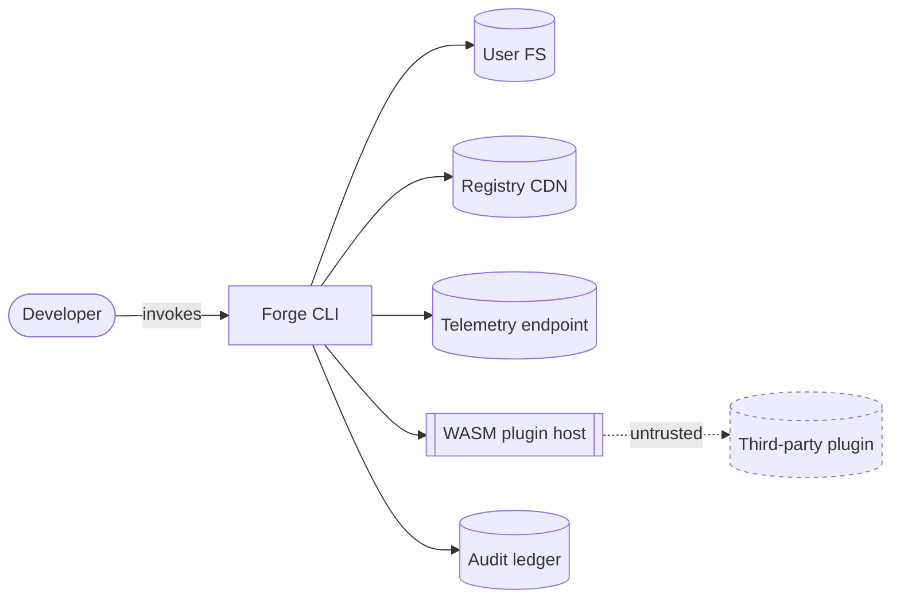

# Forge — Threat model

> Skeleton per ADR-010 (STRIDE + LINDDUN-lite). This file is the workspace-level threat model and is updated whenever a feature spec carries `security_review.required: true`.

## 1. Scope

- In-scope: the Forge CLI binary, the registry resolver, the WASM plugin host, the audit ledger, telemetry payloads, secret-scanning allowlists, release artefacts.
- Out-of-scope (this version): user-application runtime, third-party LLM providers' internal threats, downstream packagers' own infra.

## 2. Assets

| Asset | Sensitivity | Owner |
|-------|-------------|-------|
| User source code | High (confidentiality) | User |
| Secrets in env / repo | Critical | User |
| Audit ledger | High (integrity) | Forge core |
| Plugin manifests | Medium (integrity) | Registry custodians |
| Release private keys | Critical | Two custodians (per ADR-022) |
| Telemetry payloads | Medium (privacy) | Forge core |

## 3. Trust boundaries



Boundaries:

- **B1** Developer ↔ CLI (process boundary; CLI runs with user privileges).
- **B2** CLI ↔ Registry CDN (network; HTTPS + signed manifests per ADR-004).
- **B3** CLI ↔ WASM host ↔ plugin (sandbox; capability-mediated).
- **B4** CLI ↔ telemetry endpoint (network; opt-in, redacted per ADR-006).

## 4. STRIDE threats (examples)

```yaml
api_version: forge.sh/v1
kind: ThreatRegister
spec:
  entries:
    - id: T-001
      stride: Tampering
      asset: Audit ledger
      boundary: B1
      description: >
        Local attacker with write access to `.forge/ledger/` rewrites past
        entries to hide a malicious `forge fix --apply` run.
      mitigations:
        - Per-host signing key; verifier detects rewrite (FORGE-1101).
        - `forge audit ledger` runs in CI / pre-commit.
      residual_risk: low
      drill_anchor: drill-ledger-tamper

    - id: T-002
      stride: Elevation of Privilege
      asset: User FS
      boundary: B3
      description: >
        Malicious plugin escapes WASM sandbox via host-function abuse and
        writes outside the declared capability scope.
      mitigations:
        - Capability-typed WIT world (per ADR-002).
        - Default-deny FS capability; explicit grant per plugin.
        - wazero fuel/instruction-budget + memory limits (per ADR-002).
      residual_risk: medium
      drill_anchor: drill-plugin-panic

    - id: T-003
      stride: Information Disclosure
      asset: Telemetry payloads
      boundary: B4
      description: >
        Secrets from error messages leak via OTLP traces despite redactor.
      mitigations:
        - Shared regex redactor with secret-scanning engine (ADR-013).
        - Allowlist of permitted fields (ADR-006).
        - Opt-in default off.
      residual_risk: low
      drill_anchor: drill-secret-leak-debug
```

## 5. LINDDUN-lite privacy threats

```yaml
    - id: P-001
      linddun: Linkability
      data: Telemetry session_id
      description: >
        Stable session_id allows correlating multiple Forge invocations
        across days, enabling user fingerprinting.
      mitigations:
        - session_id rotates per process invocation.
        - No persistent install_id.
      residual_risk: low

    - id: P-002
      linddun: Detectability
      data: Plugin install events
      description: >
        Telemetry indicates which plugin a user installed, revealing
        organisational tooling choices.
      mitigations:
        - Plugin install events are opt-in within the broader telemetry opt-in.
        - Aggregated weekly counts only; no per-event records.
      residual_risk: medium
```

## 6. Mitigation index

| Mitigation control | Implemented by | Test anchor |
|--------------------|----------------|-------------|
| Capability-typed plugin host | ADR-002 | DEV-M1-XX |
| Per-host ledger signing | Arch §17.2 row 5 | TEST-23 |
| Telemetry redactor | ADR-006 | TEST-related |
| Secret allowlist expiry | ADR-013 | TEST-24 |
| Two-custodian release signing | ADR-022 | DEV-M3-20 |

## 7. Open items

- Threat-model coverage for the Doctor verb (post-M0).
- LINDDUN-lite expansion to cover plugin telemetry once T3 plugin telemetry exists.
- External pen-test pre-1.0 (OPS-related; budget pending).

---

*Threat-model version: 0.1 — companion to ADR-010.*
